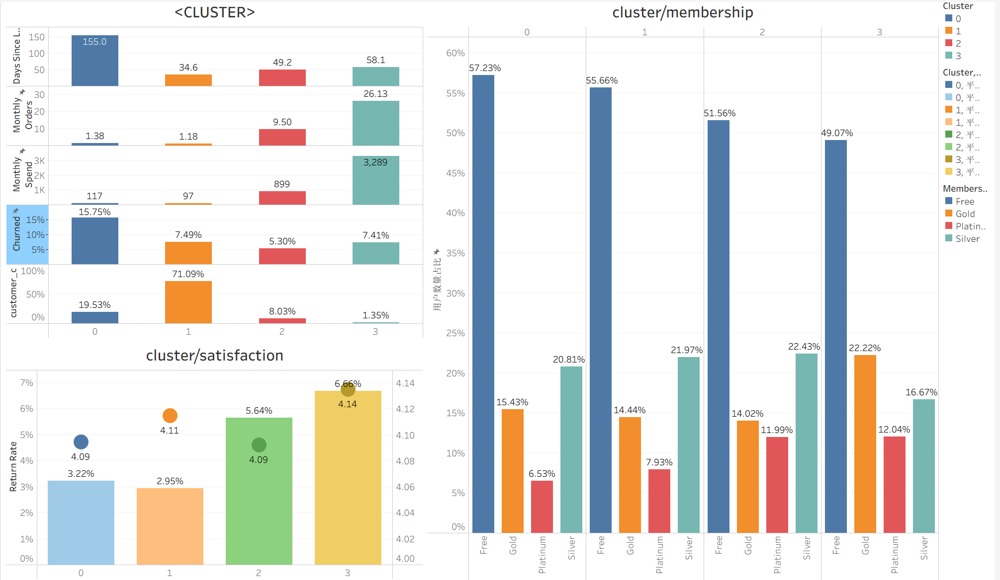
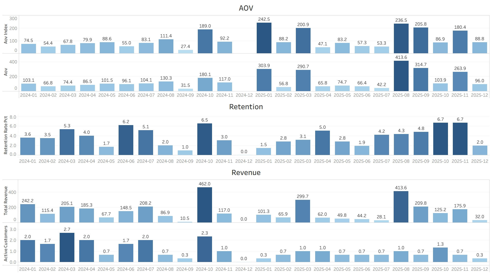
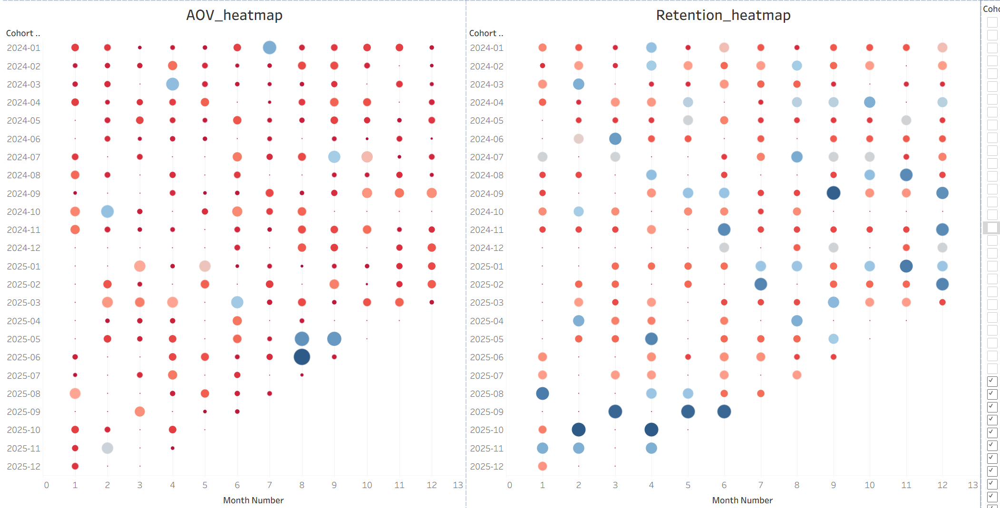
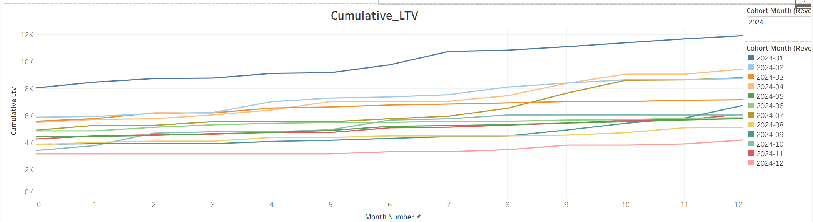
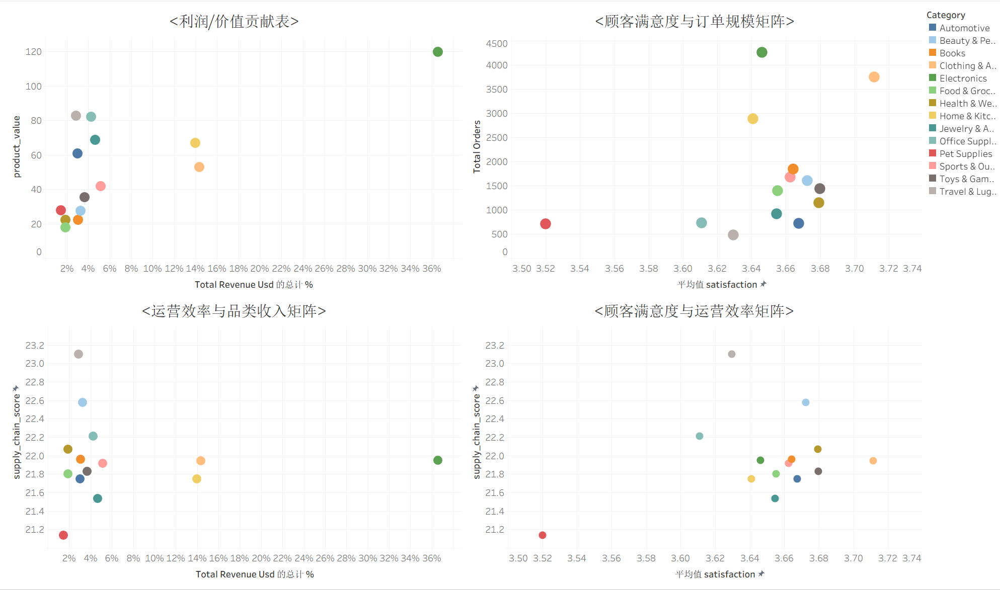
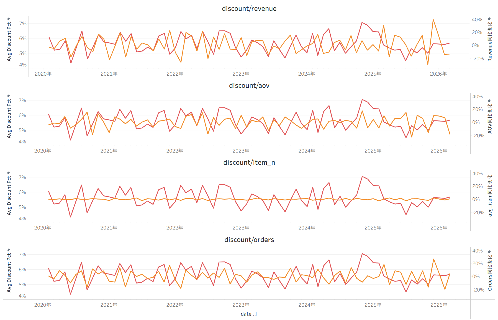

# 电商用户增长与价值分析：从全链路数据挖掘到 LTV 策略优化

## 项目背景
本项目通过对电商平台用户、订单及品类的深度挖掘，构建了“价值分层 — 流失预测 — 渠道分析 — 同期群表现 — 品类价值矩阵 — 折扣影响评估”的分析全链路。
旨在回答核心业务问题：如何从“短期流量增长”转向“长期用户价值增长”，通过更高质量的用户、渠道、品类与运营策略，实现平台留存、复购与LTV的持续提升？

## 数据架构
项目涵盖四大核心数据表，并进行了严格的数据清洗与特征工程：
Customer表：记录用户属性、会员等级及注册时长等。
Orders表：详细记录交易金额、折扣、配送时长及设备等。
Monthly Revenue表：月度营收指标，用于监控平台整体增长趋势。
Product Summary表：品类维度的经营表现聚合。

## 核心分析板块与深度洞察
## 1. 用户价值分层与行为画像 (K-Means 聚类)
利用 K-Means 算法，基于 R (最近消费天数)、F (月订单量)、M (月消费额) 指标将用户划分为四类典型群体，并结合满意度与退货行为进行了深度剖析，并结合会员体系进一步分析：

**Cluster 3 超级 VIP** ：评分最高 (4.14) 但退货率也最高 (6.66%)。

*建议*：高满意度不等于低退货，需优化选品减少摩擦。

**Cluster 2 高价值忠诚用户**：呈现“高频购买+中频退货”模式，退货率比沉睡用户高出 2%

*建议*：需定位高退货品类。

**Cluster 1 普通活跃用户**：占比 71%，评分次高且退货率最低 (2.95%)。

*建议*：是平台最“健康”的群体。

**Cluster 0 沉睡用户**：评分不低 (4.09) 却活跃度低，流失主因并非产品不满。

*建议*：通过场景化推送激活。

**会员发现**：铂金会员在核心用户中的占比是流失用户的 2 倍。

## 2. 流失预测模型与归因分析 (Logistic Regression)
**时间维度**：消费间隔越长，流失风险呈指数级上升。

*建议1*：构建时间窗口自动召回：针对未复购用户，在30 天、60 天、90 天三个关键节点设置自动触达（如个性化优惠券、场景化文案推送），打断沉默惯性。

*建议2*：低干预唤醒沉睡用户：优先使用小额唤醒券、购物车降价提醒、节气关怀等轻量方式测试其反应，避免高成本让利。

*建议3*：启动老用户激活专项：对注册2 年以上的老用户，策划“会员周年礼”“时光专属折扣”等情感化活动，强化归属感，延缓使用疲劳。

**渠道质量**：付费广告渠道用户流失风险显著高于直接获客，存在“低意向”问题。

**反直觉发现**：高退货率在模型中体现为“活跃”信号，退货往往是高频交易的副产物。

**等级差异**：Silver 会员流失风险最低，

*建议*：重新审视金/铂金等级的权益梯度设置。

## 3.渠道质量分析（分配权重，构建渠道评分体系）
**Paid Ad**:流失率较高，但LTV高、用户生命周期长，综合评分最高

*建议*：针对付费广告“低意向用户”问题，优化投放定向与素材，引入预注册行为筛选、落地页教育内容，提高流入用户的长期价值而非单纯点击量。

**Organic Search**:综合表现稳定，评分仅次于Paid Ad

*建议*：保障其预算，并将自然搜索作为低成本高价值壁垒持续投入。

**Social Media**:存在明显高流量、低留存问题

*建议*:减少单纯曝光型投放，强化用户筛选，，转向KOC 深度种草、社群精细化运营。

## 4. 同期群 (Cohort) 深度诊断报告
通过对 2024-2025 年获客群的持续追踪，识别出三种典型的用户贡献模式：
### 用户行为模式分类
**模式一：健康增长型 (如 2024.10, 2025.08)：** 留存、AOV、利润三高，拉新渠道与用户质量高度匹配。

**模式二：流量型但转化弱 (如 2024.06-07)：** 用户愿意复购但客单价低，多为促销敏感型用户。

**模式三：高价值但留不住 (如 2025.01)：** AOV 极高但留存差，多为电子产品等长决策周期品类的一次性消费。
### 关键发现
**“磨合期”效应：** 用户在 M1-M5 波动剧烈，M6 之后行为趋于稳定，前6个月决定长期价值。

*建议*：建议多阶段运营模型，M0-M3为关键养成期（建立复购习惯），M3-M6为价值稳定期（提升长期LTV）。

**“高开低走”陷阱：** 2024.10 Cohort 早期表现完美，但 M9-M12 表现垫底。

*建议*：评估 LTV 必须引入“衰减率”指标，防止早期数据误导决策。

**黄金基准 (2024.01)**：该批次累积 LTV 为全平台“天花板”，

*建议*：复刻 2024.01 黄金 Cohort 的拉新渠道、首单品类及营销触点，作为 2026 年的获客指导。

**异常预警**：2024.12 出现 M1-M3 零留存，

*建议*：需排查当时是否存在技术故障或严重物流中断。
## 5. 品类价值矩阵 (Category Matrix)
通过四象限矩阵将分析从“人”下沉到“货”。

**Electronics (核心支柱)**：利润占比达 37%，是收入引擎。

*建议*：巩固优势，加大售后链路优化与满意度管理，降低高客单退货损失。

**Travel & Luggage (高潜力)**：单价极高且运营效率领先，但利润占比仅 3%。

*建议*：利用其高运营效率，通过组合销售（旅行套装）、引入高毛利配件释放利润潜力，扭转“价值-利润”错配

**Pet Supplies (待改善)**：利润贡献极低 (1.5%) 且评分与效率双低。

*建议*：立即审查供应链效率与客户投诉，评估淘汰长期负毛利 SKU 或重构选品标准。

## 6. 折扣效果深度评估 (2020-2026)
通过长达 6 年的月度数据同比趋势，揭示了折扣策略的真实效果。

**利润挤压**：折扣与利润呈现“弱负相关”，提高折扣虽能刺激短期销量，但显著压缩了盈利空间。

**深度不足**：折扣对提升客单价(AOV)和销售件数(item)的作用不明显，用户并未因为打折而买得更多。

**核心洞察**：目前的折扣更多是“流量型促销”，未能有效转化成长期用户价值。

*建议*：减少无差别大促，设计如满减、组合购等旨在提升客单价的精准优惠

## 业务建议
1. 平台增长应从“流量驱动”转向“LTV驱动”，重点关注高质量用户的长期留存与复购，而非短期GMV增长。
   
2. 用户价值在前6个月基本定型，应围绕不同生命周期阶段建立精细化运营体系，提高长期用户价值。
   
3. 付费广告虽能带来高LTV用户，但存在低意向问题，未来应优化投放定向与渠道质量，而非单纯扩大流量。
   
4. 当前折扣策略更多带来短期销量，未有效提升长期价值，建议减少无差别大促，转向提升AOV与复购率的精准优惠。
   
5. Electronics 等高利润品类应强化售后与体验管理；低利润低评分品类如pet supplies需优化供应链或淘汰低效SKU。
    
6. 建议建立“用户 × 渠道 × 品类”联合分析框架，并逐步搭建流失预警、LTV预测与个性化推荐体系，实现从“结果分析”向“预测型运营”升级。

## Tableau Dashboard
👉[cluster分析](https://public.tableau.com/views/cluster_17788383068860/1?:language=en-US&publish=yes&:sid=&:redirect=auth&:display_count=n&:origin=viz_share_link)

👉[cohort分析](https://public.tableau.com/views/cohort_17788387818190/1?:language=en-US&publish=yes&:sid=&:redirect=auth&:display_count=n&:origin=viz_share_link)

👉[品类价值矩阵](https://public.tableau.com/views/_17788389325870/1_1?:language=en-US&publish=yes&:sid=&:redirect=auth&:display_count=n&:origin=viz_share_link)

👉[折扣分析](https://public.tableau.com/views/discount_17788389564210/1?:language=en-US&publish=yes&:sid=&:redirect=auth&:display_count=n&:origin=viz_share_link)

## 技术栈
**数据处理：** Python (Pandas, Numpy), Excel

**建模分析：** K-Means (聚类), Logistic Regression (流失归因)

**可视化：** Tableau (Cohort Heatmap, LTV Curves), Matplotlib/Seaborn

**数据库：** Sql
